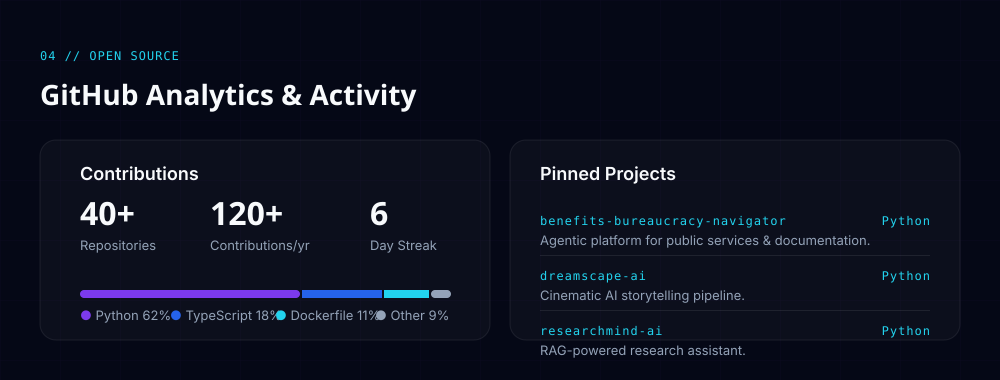

  

  

  

  

  

<h2 align="center">Analytics & Activity</h2>

  

  <picture>
    <source media="(prefers-color-scheme: dark)" srcset="https://raw.githubusercontent.com/Devadn11206/Devadn11206/output/github-contribution-grid-snake-dark.svg">
    <source media="(prefers-color-scheme: light)" srcset="https://raw.githubusercontent.com/Devadn11206/Devadn11206/output/github-contribution-grid-snake.svg">
    
  </picture>

  

